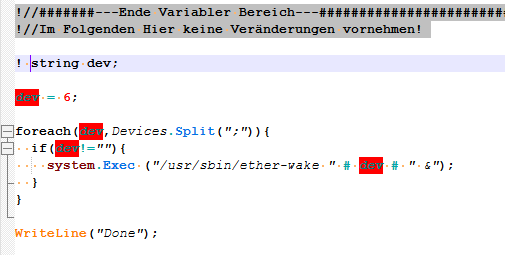

# Homematic Lexer Plugin

## Overview

Homematic Lexer Plugin is an external lexer for Homematic scripts for Notepad++.
It uses the same lexing formats as the
[SDV 5.0 Script-Developer-CCU](https://github.com/HMMike/Script-Developer-CCU).
This includes detection of unsued variables.

## Background

While it is possible to use a User Defined Language (UDL), the unusual comment character `!` and the contexts in which it is used as a negator make reliable lexing difficult.

When I first started writing CCU scripts, I used `.c` file extensions and a form of “double comments”: an exclamation mark combined with C-style comments, such as `!//`. However, this caused inconsistent keyword parsing.

As a result, I decided to implement a fully custom lexer.
The color and style definitions are closely aligned with SDV 5.0.

## Features

* It uses a similar color schema like SDV 5.0. It also parses variable definitions and tries to format them accordingly.
* Included all constant and fucntion names I can retrieve from the Homematich forum and documentation.
* Correct parsing of comments (`!` character) and cares about operators starting with `!` to, like `!=`. Comments are allowed after a statement (ending `;`), or directly after a closing or open brace (`{`, `}`)
* The folding feature is taken from the `LexCPP` from the NotePad++ project.
* If a variable has the same name like a reserved name, it is formated as a variable, not as a define or constant.
* **A real sepcial feature is the detection of undefined variables, similar as in SDV. They are shown in red backround letters.


  
## Used Code and References

This project is based on the
[Notepad++ plugin template](https://github.com/npp-plugins/plugintemplate).

Special thanks to
[Notepad++ plugin with crude external lexer](https://github.com/moon6969/NPP-lexer-example),
which provided a helpful starting point for external lexer development.

Documentation for lexer development is limited. Neither
[Scintilla](https://www.scintilla.org/ScintillaDoc.html) nor
[Notepad++](https://npp-user-manual.org/docs/plugin-communication/)
provides comprehensive guidance for creating custom or external lexers.

The following files were copied from the Notepad++ source tree:

* [Scintilla files](scintilla/include/)
* [Lexilla / lexlib files](lexilla/lexlib/LexerBase.h)

For implementation details, it is recommended to study the built-in lexer sources, for example the
[C++ lexer](lexilla/lexers/LexCPP.cxx).
The code for folding blocks is taken from this file.

## Build Notes

The plugin was developed using Visual Studio 2022.
The `HomematicNPPLexerPlugin.vcxproj` file specifies:

```
<PlatformToolset>v145</PlatformToolset>
```

## Installation

Copy the plugin DLL to:
```
plugins\HomematicNPPLexer\HomematicNPPLexer.dll
```

Copy the XML configuration file to:
```
plugins\Config\HomematicNPPLexer.xml
```

### Installation Paths

**64-bit installation**

* `%PROGRAMFILES%\Notepad++\plugins\HomematicNPPLexer\`
* `%PROGRAMFILES%\Notepad++\plugins\config\`

**32-bit installation**

* `%PROGRAMFILES(x86)%\Notepad++\plugins\HomematicNPPLexer\`
* `%PROGRAMFILES(x86)%\Notepad++\plugins\config\`

**Portable installation**

* `<portable Notepad++ directory>\plugins\HomematicNPPLexer\`
* `<portable Notepad++ directory>\plugins\config`

## Verification

After installation, **HomematicNPPLexer** should appear:

* In the *Language* menu
* At the bottom of *Settings → Style Configuration*
